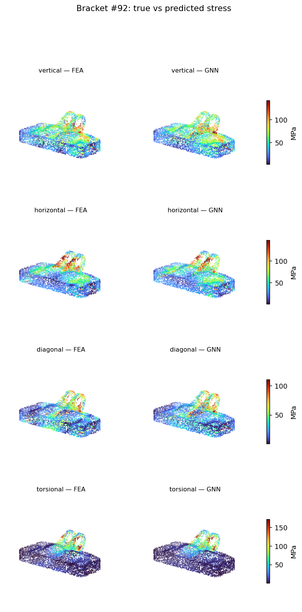

# Stress-Field Prediction on Jet-Engine Brackets with a Graph Neural Network

I trained a graph neural network (GNN) to predict the **von Mises stress field** on the
surface of a jet-engine bracket directly from its geometry — turning a minutes-long
finite-element (FEA) solve into a millisecond prediction. It's a small, honest study of
surrogate modeling for simulation/CAE workflows.



## What it does

Given the surface shape of a bracket, the model predicts the full stress field (one value
per surface point) for **four standardized load cases**: vertical, horizontal, diagonal and
torsional. The surface is sampled as a point cloud, connected into a k-nearest-neighbour
graph, and passed through an EdgeConv (DGCNN-style) GNN that learns the local-geometry ->
stress mapping.

## Data

[SimJEB](https://simjeb.github.io/) — a public benchmark of **381 jet-engine bracket designs**,
each with an FEA stress solution under the four load cases above. The load, supports and
material (titanium) are identical across all brackets; only the geometry changes, which makes
it a clean geometry -> stress learning problem. I use the dataset's official train/test split.

> Whalen, E., Beyene, A., Mueller, C. (2021). *SimJEB: Simulated Jet Engine Bracket Dataset.*
> Harvard Dataverse. CC0. https://simjeb.github.io/

## Method

- **Nodes:** 8,000 surface points per bracket, coordinates normalized per bracket.
- **Node features (9):** position (3) + surface normal (3, from local PCA) + standardized
  global size (log volume / mass / surface area).
- **Edges:** undirected k-NN (k = 12). *(SimJEB ships no per-bracket surface mesh, so edges
  come from k-NN rather than true mesh connectivity.)*
- **Targets:** per-node von Mises stress for the 4 loads, `log1p`-transformed and standardized.
- **Model:** 4 stacked EdgeConv layers (hidden 128), outputs concatenated -> MLP head.
  ~0.23 M parameters. MSE loss, Adam (1e-3) with cosine annealing, 250 epochs.

## Results

Held-out test set (77 brackets the model never saw). `corr` is the median per-bracket Pearson
correlation between the predicted and true fields — i.e. are the hot-spots in the right place?

| Load case  | Test R2 | Test MAE (MPa) | Test spatial corr |
|------------|:------:|:--------------:|:-----------------:|
| Vertical   |  0.17  |      67        |       0.64        |
| Horizontal |  0.30  |      63        |       0.59        |
| Diagonal   |  0.25  |      48        |       0.57        |
| **Torsional** | **0.43** |  28        |     **0.82**      |
| **Overall**   | **0.29** |  —         |        —          |

**The interesting part:** the GNN is *strongest on torsion* — exactly the load case a
geometry-feature baseline is blind to. A RandomForest predicting peak stress from global
features (volume, mass, etc.) scores about **R2 ~ 0.04** on torsion, because torsional
response depends on local shape the global features can't see. The GNN reproduces the
torsional field with **0.82 spatial correlation** on unseen brackets.

The model is better at *where* stress concentrates than at the exact magnitude — which is what
you'd want from a fast design-screening surrogate that flags likely failure regions.

## Honest limitations

- **Small data.** With ~300 training shapes the model overfits: train overall R2 ~ 0.69 vs
  test ~ 0.29. The spatial-correlation metric generalizes better than absolute R2.
- **k-NN edges, not real mesh.** Without surface connectivity the graph is approximate.
- **Fixed loads/material.** The 4 outputs are the dataset's 4 fixed load cases; the model does
  not yet take arbitrary loads or materials as input.

## Future work

- More shapes (e.g. the larger DeepJEB dataset) + regularization / early stopping.
- True mesh edges (MeshGraphNets-style) instead of k-NN.
- Load and support conditions as node features, to generalize beyond the 4 fixed cases.
- Use the surrogate inside a shape-optimization loop.

## How to run

Open `simjeb-stress-gnn.ipynb` in Google Colab on a **GPU** runtime. Download the SimJEB
`dataverse_files.zip` to your Drive and point the `ZIP` path (in the Setup cell) at it, then
run the cells top to bottom. The data extraction is cached after the first run.

```
pip install -r requirements.txt
```

---

Built as a portfolio project at the intersection of **simulation/CAE methodology and machine
learning** — surrogate models that accelerate engineering workflows.
